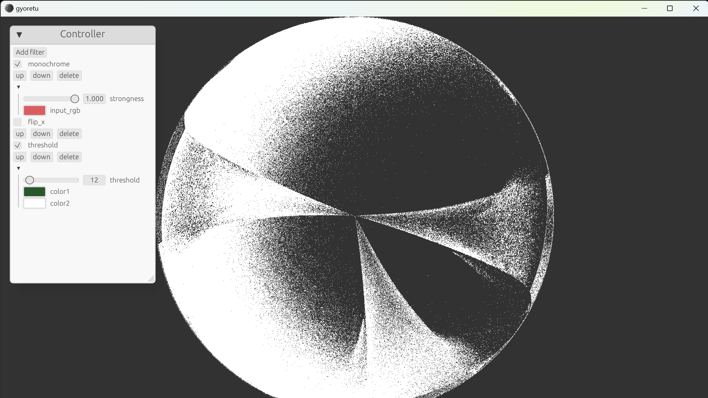

### 概要
pngの連番画像を読み込んで、フィルターをかけるアプリケーションです。shader toyのように pixel 単位で制御したフィルターを自由に作る事ができます。申しわけ程度のGUIもあります。

### road map

- [x] GUIを用いて、ソースとなる連番画像をlocal fileから選択できるようにする。
- [ ] 複数の連番画像をソースとできるようにする。
- [ ] 実行環境を保存できるようにする。
- [ ] モード（乗算・オーバレーイ等）の追加
- [ ] フィルターの追加
- [ ] フレームをレンダリングするGUI及び機能の追加
- [ ] FPSなどのフレームの情報をGUIで確認できるようにする。
- [ ] 音源をソースとして再生可能にする
- [ ] wavやキーボードをフィルターの入力とする

### 使用した他人のコード

ライセンスの書き方が分からないので、参照したチュートリアルやサンプルコードのリンクを貼っておきます。

https://sotrh.github.io/learn-wgpu/ wgpuの使い方が分かります。

https://github.com/gfx-rs/wgpu/tree/trunk/examples wgpuのdemoがあります。

https://github.com/googlefonts/compute-shader-101 wgpuでcompute shaderを用いた分かりやすい例（copy.wgslのコードを借用しています）。

https://www.egui.rs/ eguiのデモ。

https://github.com/ejb004/egui-wgpu-demo egui-wgpuのデモ（gui関連のコードを借用しています）。

